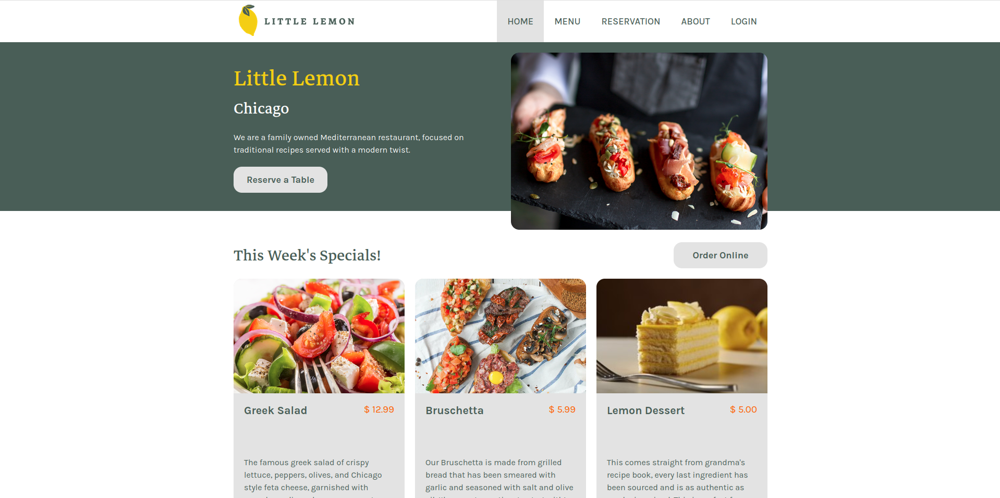

# Little Lemon Restaurant Website

## Introduction
This is a META's Front End 
specialization project from Coursera. In this project, from the beginning with figma wireframe design and figma UI design, I created a restaurant website with ReactJS. I tried to use all the features of ReactJS. I made a table reservation system, menu , functions to add orders, add items to cart , remove items delete items and reservation etc...

## Description
This website uses the hosted json file using json-server via render.com, to fetch data like menu item, reservation information, and added cart, order items in profile.
This wevsite designed like how a particular E-commerce or Restaurant website works

## After cloning this project, follow these steps to get up and running:

1- Install dependencies: <strong> npm install </strong>

2- Start the JSON server in a separate terminal window: <strong> json-server --watch src/data/little_lemon_database.json --port 4000  </strong>   (replace 4000 with your desired port number if needed)

3- Run the application in the first terminal window:  <strong> npm start  </strong>

This will launch the React application and allow you to interact with it in your browser (usually at http://localhost:3000 by default).

